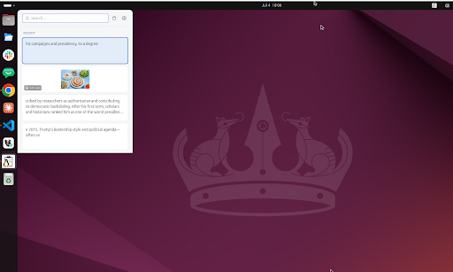

<p align="center">
  
</p>

<h1 align="center">Linux Clipboard</h1>

A Windows-10-style clipboard history manager for Linux (Ubuntu / GNOME), built
with **Tauri v2 + React + TypeScript + Tailwind** (frontend) and **Rust**
(backend). Runs in the background, records everything you copy (text + images),
and pops up a Win+V-style panel on a hotkey so you can pick an item and paste it.

## Features
<p align="center">
  
</p>


- Background clipboard monitor (text + images), most-recent-first, de-duplicated
- Frameless popup panel, shown near the cursor (X11) or centered (Wayland)
- **Pinned snippets** that survive the history cap and sort to the top
- Search, delete single items, clear history
- **Auto-paste** (simulated Ctrl+V) into the previously focused app — toggleable;
  falls back to copy-only when synthetic input isn't available
- Two ways to trigger the panel:
  - **In-app global hotkey** (rebindable in Settings) — works on **X11**
  - **GNOME custom shortcut** helper that runs `<app> --toggle` — works on
    **X11 and Wayland** (a one-click button configures it via `gsettings`)
- System tray menu (Show / Settings / Quit) and run-on-login (autostart)

## Prerequisites

Rust (via `rustup`) and Node.js are required. The Linux build also needs GTK /
WebKit development headers and a few tools. On Ubuntu:

```bash
sudo apt update && sudo apt install -y \
  libwebkit2gtk-4.1-dev build-essential curl wget file \
  libxdo-dev libssl-dev libayatana-appindicator3-dev librsvg2-dev \
  pkg-config
```

- `libwebkit2gtk-4.1-dev` + `build-essential` — required to compile a Tauri app
- `libxdo-dev` — required by `enigo` for X11 auto-paste (Ctrl+V simulation)
- `libayatana-appindicator3-dev` — the system tray icon (needs the GNOME
  *AppIndicator* extension to actually show on GNOME)
- `libxkbcommon-dev` — Wayland auto-paste (keysym→keycode via the compositor keymap)

Wayland auto-paste needs no extra tool: it goes through the XDG **RemoteDesktop
portal** (`xdg-desktop-portal-gnome` on GNOME, `xdg-desktop-portal-kde` on KDE —
both ship by default). The first paste shows a one-time "Allow this app to
control your computer?" consent dialog; it's silent thereafter.

## Develop / build

```bash
npm install            # frontend deps
npm run tauri dev      # run the app (hot-reload frontend)
npm run tauri build    # produce .deb in src-tauri/target/release/bundle
```

## How it works

The **backend owns everything stateful**, which keeps behavior robust:

- **Clipboard** — a Rust polling thread (`arboard`) watches for changes. Our own
  paste-back writes are suppressed (a short time-window flag) so they aren't
  re-recorded; identical re-copies move the existing entry to the top.
- **Storage** — `rusqlite` (bundled SQLite) in the app data dir; images are
  stored as PNG files + a thumbnail, referenced by rows in the DB.
- **Paste-back** — set clipboard → hide panel (focus returns to the target app)
  → short delay → simulate Ctrl+V (`enigo` on X11; the XDG RemoteDesktop portal
  + libei on Wayland — through the compositor, no `/dev/uinput`).
- **Hotkey** — `tauri-plugin-global-shortcut` (X11). On Wayland it can't receive
  global hotkeys, so `tauri-plugin-single-instance` forwards `--toggle` from a
  GNOME custom shortcut to the running instance instead.

### Data locations

- History DB: `~/.local/share/com.datluong.linuxclipboard/history.db`
- Images: `~/.local/share/com.datluong.linuxclipboard/images/`
- Settings: `~/.config/com.datluong.linuxclipboard/settings.json`

## Notes / limitations

- **Wayland**: in-app global hotkeys and cursor-relative positioning don't work;
  use the GNOME-shortcut helper (panel opens centered). Auto-paste works via the
  RemoteDesktop portal (libei) after the one-time consent prompt.
- **GNOME tray**: the tray icon requires the AppIndicator/KStatusNotifier
  extension. The hotkey remains the primary way to open the panel.
- Terminals that use `Ctrl+Shift+V` won't receive the simulated `Ctrl+V`; the
  content is still on the clipboard for a manual paste.
